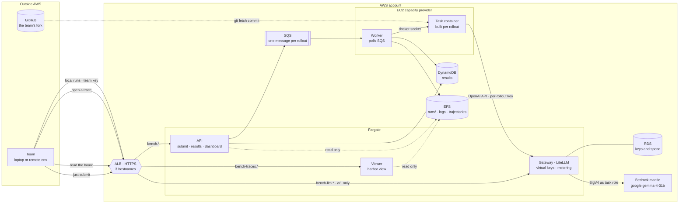
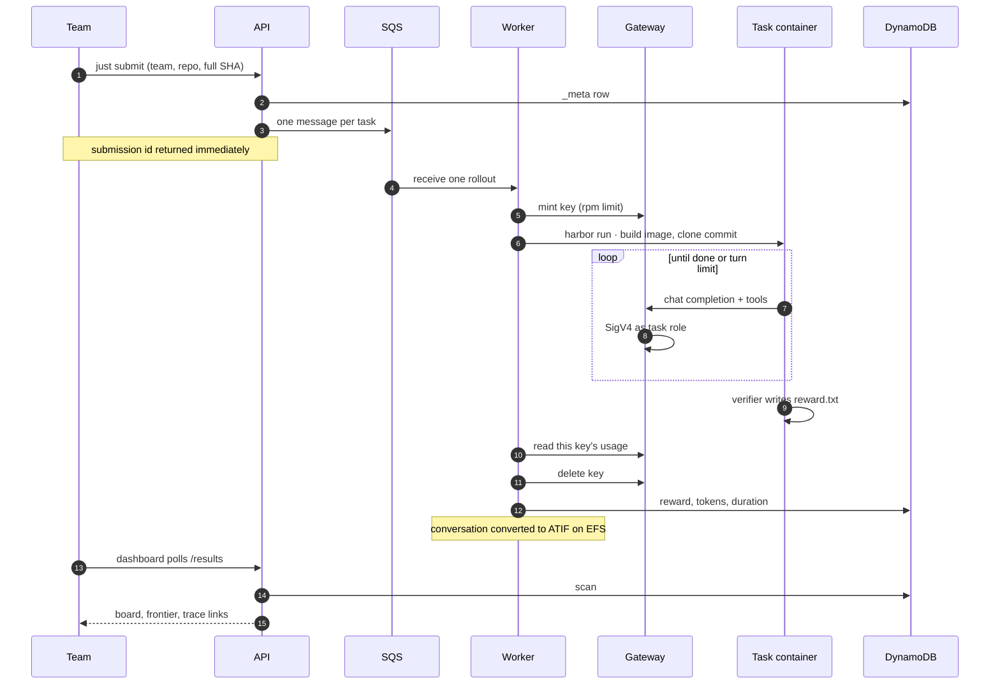

# Data Engineering Agent Benchmark

A hackathon where every team gets the same model and competes on everything
else: harness, skills, MCP servers, context engineering.

Design: [`docs/plans/2026-08-04-data-engineering-benchmark-hackathon-design.md`](docs/plans/2026-08-04-data-engineering-benchmark-hackathon-design.md)

## Start here

You need [Docker](https://docs.docker.com/get-started/), [uv](https://docs.astral.sh/uv/),
[just](https://github.com/casey/just) and [harbor](https://pypi.org/project/harbor/),
plus the team key from the kickoff message.

```
export GATEWAY_API_KEY=sk-...   # your team key
just eval                       # run a task against your agent
just view                       # what your agent actually did
just submit your-team           # when you want it scored
```

Fork this repo. Your agent is `agent/` and the benchmark is `tasks/`, in the
same tree: one clone, no second repository to keep in step.

`just eval` mounts your working tree, so there is no commit-push-wait loop: edit,
run, look, repeat. It talks to the shared gateway, so there is nothing to run
locally beyond the task container itself.

**Behind a TLS-intercepting proxy** (many corporate networks), the agent's call
to the gateway fails with a bare connection error that never mentions TLS. Put
your CA bundle somewhere Docker can share and set `CORP_CA_FILE` in `.env`;
`just eval` then mounts it into the task container. Check with:

```
docker run --rm curlimages/curl -sI https://bench-llm.playground.dataminded.cloud/v1/models
```

A connection failure there, where the same request works from your shell, is
interception rather than a network problem.

Then read the trajectory. The thing that decides your score is what ends up in
the context window, and you cannot fix what you have not looked at.

## Layout

| Path | What it is |
|---|---|
| `tasks/` | The benchmark. One directory per task: Dockerfile, fixtures, pytest verifier |
| `agent/` | Your agent. Baseline to beat, uv project, fixed entrypoint |
| `docs/` | Design notes |
| `ops/` | Everything that runs the event. Not needed to compete |

Every task is here and you can run any of them, which is not an invitation to
run them all: the full suite takes hours on a laptop and tells you nothing you
could not learn from one failure. Pick a task you lose, find where your agent
goes off the rails, fix the context, run it again.

## Submitting

```
just submit your-team
```

It refuses uncommitted or unpushed work and sends the full commit hash, because
each of those fails twenty minutes later rather than immediately. Five
submissions of the full suite; local runs are unlimited and unscored.

## Running the event

Everything below is for whoever is operating the benchmark.

```
just eval            # run agent/ against a sample task
just calibrate       # oracle must score 1.0, nop must score 0.0
just api             # builds the frontend, serves it and /results on :8000
just worker          # polls SQS, runs rollouts, writes DynamoDB
just test            # scoring rules self-check
just gateway         # a local LiteLLM instead of the deployed one
```

## Deploying

```
terraform -chdir=terraform apply -var-file=dev.tfvars    # while building
terraform -chdir=terraform apply -var-file=event.tfvars  # on the day
terraform -chdir=terraform apply -var-file=off.tfvars    # when idle
just deploy         # build and push both images, roll the services
```

The fleet is the entire bill, so it is a variable rather than a default:

| Preset | Hosts | Concurrent rollouts | Per hour | 5-hour event | Left running 30 days |
|---|---|---|---|---|---|
| `dev` | 1 x c7i.xlarge | 1 | $0.20 | $1 | $147 |
| `event` | 4 x c7i.2xlarge | 12 | $1.63 | $8 | $1,173 |
| `off` | none | 0 | $0 | - | $0 |

Four small hosts cost the same per hour as one large one and lose a quarter of
the in-flight rollouts if a host dies rather than all of them. Bedrock is not
the cost: 1000 rollouts at the measured $0.003976 is about $4 for the whole
event, so leaving the fleet up overnight costs more than running the benchmark
ten times.

Most development needs no fleet at all. `just eval` runs the identical rollout
on your laptop for nothing, through the same Harbor path the workers use, so
bring `dev` up only to exercise ECS itself.

`off.tfvars` leaves the Fargate services and the load balancer up at roughly
$0.11/hr, which is the price of keeping the dashboard reachable.

The two services share nothing but `ops/platform/common`: the results table shape
and the ranking rules. Each image copies only its own package, so the API
carries no Harbor and the worker carries no frontend. The IAM policies enforce
the same split, so the API cannot consume the queue and the worker cannot
enqueue.

Everything runs on Fargate except the worker. Harbor builds and runs the task
container, which needs a Docker daemon, and Fargate has none: the worker sits on
an EC2 capacity provider with the host socket mounted and starts sibling
containers. Nothing else needs Docker, so nothing else needs instances.

Concurrency is `desired_count`. The measured rollout is 142 s, so 1000 rollouts
across a four-hour event needs about 10 in flight; 12 covers the closing spike.
Replicas share the host's image cache, so the task image builds once rather than
once per worker.

The gateway is never exposed. Only the API sits behind the load balancer, and
`dashboard_cidrs` should be narrowed to the venue before the event. Graded job
directories land on EFS, mounted by both the workers and the API, so
`harbor view` sees every rollout from one place rather than only the ones a
given replica happened to run.

## Architecture



The worker is the only service on EC2, because Harbor builds and runs the task
container and that needs a Docker daemon, which Fargate has none of. Everything
the participant touches is a hostname on one load balancer; the gateway serves
`/v1` and nothing else, so key minting and spend are unreachable from outside.

## How a submission is graded



The key is minted per rollout and retired in a `finally`, so token counts are
the gateway's rather than the graded code's, and a crashed rollout still cannot
leak a billable key. An infrastructure failure is recorded and re-raised so SQS
redelivers it: a rollout that never ran must not reach the board as a zero the
team earned.

## How a submission flows

1. `POST /submit {team, repo_url, commit}`.
2. The API writes a `_meta` row and enqueues one SQS message per task.
3. A worker clones the commit into the task container, runs the team's
   entrypoint, then runs the verifier and writes one DynamoDB row.
4. The dashboard scans DynamoDB and draws the Pareto frontier.

Tokens are read from the gateway per rollout, using a key minted for that
rollout and retired after it. Nothing about the score is self-reported by the
code being scored.

Trajectories come from the harness itself: it writes the conversation to
TRAJECTORY_PATH, and the worker converts that to ATIF beside the run's logs on
EFS, where `harbor view` renders it. Harbor never produces a trajectory on its
own -- every built-in adapter converts its own agent's log, and a trial without
that file simply has none to show.

## How the model is reached

Gemma 4 31B, model ID `google.gemma-4-31b`, is available **only** on the
`bedrock-mantle` endpoint. It is not on `bedrock-runtime`, so Converse,
InvokeModel and Messages do not work and LiteLLM's `bedrock/...` provider
cannot reach it.

LiteLLM has a `bedrock_mantle` provider that signs with SigV4 over the standard
AWS credential chain whenever no api_key is set, so the deployed gateway
authenticates as its ECS task role and there is no credential to rotate. The
permission is `bedrock-mantle:CreateInference` on a project ARN -- bedrock-mantle
is its own service namespace, and a `bedrock:` grant does nothing for it.

Two model quirks are absorbed in the gateway config rather than in every
harness: Bedrock enables reasoning by default and then refuses function tools
unless `reasoning_effort` is explicitly `"none"`, and LiteLLM would strip that
parameter without an `allowed_openai_params` entry, since it has no capability
map for a custom model.

Swapping to self-hosted Gemma on Scaleway means pointing one model definition at
a different provider.

Regions: `us-east-1`, `us-east-2`, `us-west-2`, `eu-central-1`. **Not
`eu-west-1`.**

Constraints worth knowing before you author tasks or a harness:

| | |
|---|---|
| Parallel tool calls | Not supported. One tool call per turn. |
| Reasoning content | Returned by the Responses API only, never by Chat Completions. |
| Tools + reasoning | Both together only on `/v1/responses`. Chat Completions rejects the combination outright, which is why the gateway pins `reasoning_effort: "none"` there. A harness that wants reasoning *and* tools must talk to `/v1/responses`. |
| Context window | 256K tokens |
| Request payload | 3.5 MB max, including images |
| Throughput | Ramps over time on mantle; default limits are not surfaced in Service Quotas |

## Before the event

```
just master-key                 # once, after the first apply
just team-keys alpha beta ...   # one key per team, printed once
```


- [ ] Author and calibrate the remaining tasks. Half a day each is realistic,
      so ~20 tasks is ~10 days. This is the schedule risk, not the platform.
- [ ] **Ramp the gateway ahead of time.** Mantle throughput scales with use and
      AWS explicitly warns that not all in-quota requests succeed under load.
      The worst spike is everyone submitting in the last 20 minutes, so warm it
      up rather than discovering the curve live. Consider the Priority service
      tier if committed throughput is worth the cost.
- [ ] Load test at peak: ~17 concurrent rollouts plus ten teams iterating
      locally, all against one account's throughput.
- [ ] Pick the executor once a real rollout has been timed.
- [ ] Restrict egress on the Linux worker hosts to the gateway, so a submission
      cannot quietly call a stronger model. Harbor's own allowlist only engages
      on Linux, which is why this lives on the host.
- [ ] Decide whether teams get the Responses API through the gateway. Without
      it they cannot see the model's reasoning, which is a real handicap for a
      hackathon about inspecting trajectories.
