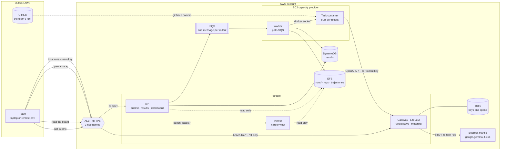
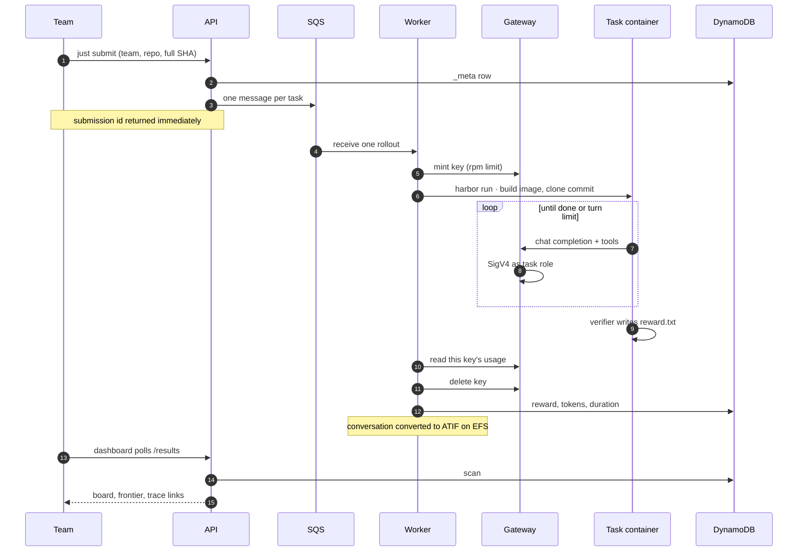

# Operating the benchmark

Everything for whoever is running the event. Competing needs none of it -- the
participant side is the [top-level README](../README.md).

Commands here are written to run from the repository root, which is where the
`just` module and the terraform state paths resolve from.

## Day to day

```
just eval                # run agent/ against a sample task
just calibrate <task>    # oracle must score 1.0, nop must score 0.0
just ops::api            # builds the frontend, serves it and /results on :8000
just ops::worker         # polls SQS, runs rollouts, writes DynamoDB
just ops::test           # scoring, results table and runner self-checks
just ops::redrive        # put dead-lettered rollouts back on the queue
just ops::gateway        # a local LiteLLM instead of the deployed one
```

`eval` and `calibrate` are the participants' own recipes; everything under
`ops::` is this half of the repo.

## Behind a TLS-intercepting proxy

Not a participant concern -- they are not on a corporate network -- but this is
where it was hit during development. The agent's call to the gateway fails with
a bare connection error that never mentions TLS. Set `CORP_CA_FILE` in `.env`
and `just eval` mounts the bundle into the task container. The tell:

```
docker run --rm curlimages/curl -sI https://bench-llm.playground.dataminded.cloud/v1/models
```

failing where the same request works from your shell.

## Deploying

```
terraform -chdir=ops/terraform apply -var-file=dev.tfvars    # while building
terraform -chdir=ops/terraform apply -var-file=event.tfvars  # on the day
terraform -chdir=ops/terraform apply -var-file=off.tfvars    # when idle
just ops::deploy                                             # build, push, roll
```

The fleet is the entire bill, so it is a variable rather than a default:

| Preset | Hosts | Concurrent rollouts | Per hour | 5-hour event | Left running 30 days |
|---|---|---|---|---|---|
| `dev` | 1 x c7g.xlarge | 1 | $0.20 | $1 | $147 |
| `event` | 6 x c7g.2xlarge | 12 | $2.45 | $12 | $1,760 |
| `off` | none | 0 | $0 | - | $0 |

Small hosts cost the same per hour as fewer large ones and lose a fraction of
the in-flight rollouts if a host dies rather than all of them. Bedrock is not
the cost: 1000 rollouts at the measured $0.003976 is about $4 for the whole
event, so leaving the fleet up overnight costs more than running the benchmark
ten times.

Two rollouts per host, not three: a replica reserves the worst task in the
suite, and three tasks ask for 6GiB. `terraform output task_budgets` prints what
the suite currently demands, and both the fleet size and the queue's visibility
timeout are derived from it -- a task that grows its budget moves them on the
next apply rather than quietly oversubscribing the hosts.

Most development needs no fleet at all. `just eval` runs the identical rollout
on your laptop for nothing, through the same Harbor path the workers use, so
bring `dev` up only to exercise ECS itself.

`off.tfvars` leaves the Fargate services and the load balancer up at roughly
$0.11/hr, which is the price of keeping the dashboard reachable.

The two services share nothing but `ops/platform/common`: the results table shape
and the ranking rules. Each image copies only its own package, so the API
carries no Harbor and the worker carries no frontend. The IAM policies enforce
the same split, so the API cannot consume the queue and the worker cannot
enqueue.

Everything runs on Fargate except the worker. Harbor builds and runs the task
container, which needs a Docker daemon, and Fargate has none: the worker sits on
an EC2 capacity provider with the host socket mounted and starts sibling
containers. Nothing else needs Docker, so nothing else needs instances.

Concurrency is `desired_count`. The measured rollout is 142 s, so 1000 rollouts
across a four-hour event needs about 10 in flight; 12 covers the closing spike.
Replicas share the host's image cache, so the task image builds once rather than
once per worker.

The gateway is never exposed. Only the API sits behind the load balancer, and
`dashboard_cidrs` should be narrowed to the venue before the event. Graded job
directories land on EFS, mounted by both the workers and the API, so
`harbor view` sees every rollout from one place rather than only the ones a
given replica happened to run.

## Architecture



The worker is the only service on EC2, because Harbor builds and runs the task
container and that needs a Docker daemon, which Fargate has none of. Everything
the participant touches is a hostname on one load balancer; the gateway serves
`/v1` and nothing else, so key minting and spend are unreachable from outside.

## How a submission is graded



The key is minted per rollout and retired in a `finally`, so token counts are
the gateway's rather than the graded code's, and a crashed rollout still cannot
leak a billable key. An infrastructure failure is recorded and re-raised so SQS
redelivers it: a rollout that never ran must not reach the board as a zero the
team earned. After the last attempt the row that is left says `error`, and an
errored row is not a completed task, so the submission waits instead of being
ranked on a rollout nobody ran. `just ops::redrive` is how it stops waiting.

Reading the meter is best effort, and deliberately not part of that: a graded
rollout is never thrown away because the gateway's admin API blinked. The row
carries the failure instead, and the board counts it, so a suspiciously cheap
submission can be told apart from a genuinely cheap one.

The harness a submission is graded with comes from the `agent.yaml` in its own
commit, which is the file participants are told decides what runs and the one
`just eval` uses. The worker fetches that commit, takes the first entry under
`agents:`, and refuses the fields that are not a team's to set -- `mounts` and
`env` most of all, because this process drives the host's Docker daemon and a
bind mount named in a submitted config would be resolved on the host.

## How a submission flows

1. `POST /submit {team, repo_url, commit}`. The team name is a key prefix, a
   directory on EFS and a path segment in every trace URL, so it is constrained
   here rather than escaped three times; `repo_url` must be https on a known
   host, because git's `ext::` transport runs a command rather than fetching a
   repository, and both the worker and the task container clone it.
2. The API spends one of the team's five submissions with a conditional update
   -- two people hitting submit at once cannot both be the fifth -- then writes
   a `_meta` row and enqueues one SQS message per task.
3. A worker clones the commit into the task container, runs the team's
   entrypoint, then runs the verifier and writes one DynamoDB row.
4. The dashboard scans DynamoDB and draws the Pareto frontier.

Tokens are read from the gateway per rollout, using a key minted for that
rollout and retired after it. Nothing about the score is self-reported by the
code being scored.

Trajectories come from the harness itself: it writes the conversation to
TRAJECTORY_PATH, and the worker converts that to ATIF beside the run's logs on
EFS, where `harbor view` renders it. Harbor never produces a trajectory on its
own -- every built-in adapter converts its own agent's log, and a trial without
that file simply has none to show.

## How the model is reached

Gemma 4 31B, model ID `google.gemma-4-31b`, is available **only** on the
`bedrock-mantle` endpoint. It is not on `bedrock-runtime`, so Converse,
InvokeModel and Messages do not work and LiteLLM's `bedrock/...` provider
cannot reach it.

LiteLLM has a `bedrock_mantle` provider that signs with SigV4 over the standard
AWS credential chain whenever no api_key is set, so the deployed gateway
authenticates as its ECS task role and there is no credential to rotate. The
permission is `bedrock-mantle:CreateInference` on a project ARN -- bedrock-mantle
is its own service namespace, and a `bedrock:` grant does nothing for it.

Two model quirks are absorbed in the gateway config rather than in every
harness: Bedrock enables reasoning by default and then refuses function tools
unless `reasoning_effort` is explicitly `"none"`, and LiteLLM would strip that
parameter without an `allowed_openai_params` entry, since it has no capability
map for a custom model.

Swapping to self-hosted Gemma on Scaleway means pointing one model definition at
a different provider.

Regions: `us-east-1`, `us-east-2`, `us-west-2`, `eu-central-1`. **Not
`eu-west-1`.**

Constraints worth knowing before you author tasks or a harness:

| | |
|---|---|
| Parallel tool calls | Not supported. One tool call per turn. |
| Reasoning content | Returned by the Responses API only, never by Chat Completions. |
| Tools + reasoning | Both together only on `/v1/responses`. Chat Completions rejects the combination outright, which is why the gateway pins `reasoning_effort: "none"` there. A harness that wants reasoning *and* tools must talk to `/v1/responses`. |
| Context window | 256K tokens |
| Request payload | 3.5 MB max, including images |
| Throughput | Ramps over time on mantle; default limits are not surfaced in Service Quotas |

## Before the event

```
just ops::master-key         # once, BEFORE the first apply: the provider needs it
just ops::team-keys          # print the teams' keys, to hand out at kickoff
```

Teams are `ops/teams.yaml`. Terraform generates a key per name, registers it
with the gateway through the `BerriAI/litellm` provider, and writes it to SSM as
a SecureString under `/de-benchmark/team-keys/` -- write-only, so the value is in
the parameter and at the gateway but never in terraform state. Reading one needs
AWS credentials for this account, and nothing is printed once and lost.

Adding a team is a name and an apply. Removing one is the same in reverse, and
that is the whole of revocation: the key is deleted at the gateway, not merely
forgotten in SSM.

This is why the gateway's admin routes are on the load balancer at all --
terraform runs where an operator runs. They are master-key authenticated and
gated on `admin_cidrs`, which defaults to `dashboard_cidrs`; narrow both to the
venue before the event. The master key can mint and delete every team's key and
rewrite the model config, so an open `admin_cidrs` is an internet-facing admin
plane whose only lock is one bearer token.

The same key is the team's identity at submit time. `/submit` takes it as a
bearer token and derives the team from it, so a team name is no longer a claim
the caller makes about itself -- before this, anyone could spend another team's
five submissions by typing their name. Revoking is deleting the name from
`teams.yaml` and applying.

Adding a team after the event has started is safe: apply mints only the new key,
then `register-keys`.


- [ ] Author and calibrate the remaining tasks. Half a day each is realistic,
      so ~20 tasks is ~10 days. This is the schedule risk, not the platform.
- [ ] **Ramp the gateway ahead of time.** Mantle throughput scales with use and
      AWS explicitly warns that not all in-quota requests succeed under load.
      The worst spike is everyone submitting in the last 20 minutes, so warm it
      up rather than discovering the curve live. Consider the Priority service
      tier if committed throughput is worth the cost.
- [ ] Load test at peak: ~17 concurrent rollouts plus ten teams iterating
      locally, all against one account's throughput.
- [ ] Pick the executor once a real rollout has been timed.
- [ ] Restrict egress on the Linux worker hosts, so a submission cannot quietly
      call a stronger model. Harbor's own allowlist only engages on Linux, which
      is why this lives on the host. It has to be an **allowlist, not
      gateway-only**: nineteen of the task images install from the network at
      build time, and both the worker and the task container fetch the
      submission from GitHub. Gateway, GitHub, PyPI, npm and ECR at a minimum,
      and rehearse it -- a rule that only lets the gateway through fails every
      task image build rather than the one thing it was aimed at.
- [ ] Decide whether teams get the Responses API through the gateway. Without
      it they cannot see the model's reasoning, which is a real handicap for a
      hackathon about inspecting trajectories.
